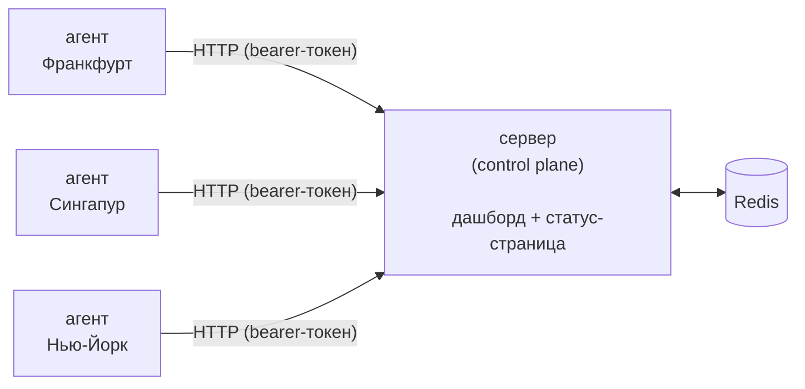

# Witness

[🇬🇧 English](README.md) | 🇷🇺 Русский

Self-hosted **мультирегиональный** мониторинг доступности: ни один инцидент не считается настоящим, пока его не подтвердят несколько независимых свидетелей.

Большинство self-hosted мониторов (Uptime Kuma, Gatus) проверяют твой сервис с одной-единственной машины. Если у этой машины моргнула сеть — ты получаешь ложный алерт в 3 ночи. А если сервис реально недоступен только для пользователей в другом регионе — монитор с одной точкой наблюдения вообще этого не заметит.

Witness гоняет лёгких агентов в нескольких регионах. Control plane объявляет сервис "down" только тогда, когда согласны **несколько независимых регионов** — один регион, который не согласен с остальными, показывается как **degraded**, а не down. В этом вся идея.



Агенты никогда не обращаются к Redis напрямую — только к HTTP API сервера с bearer-токеном своего региона. Внутри результаты идут через **Redis Stream** с consumer group, так что приём результата (HTTP-хендлер) и его обработка (консенсус + история) разделены, и при рестарте сервера результаты не теряются на полпути.

## Быстрый старт (потрогать локально, без настройки)

```bash
docker compose up --build
```

Поднимет control plane, Redis и **три демо-агента** в локальных контейнерах (это не настоящие географические регионы — просто чтобы увидеть логику консенсуса в деле). Две демо-проверки уже предзагружены.

- Дашборд: http://localhost:8080 (логин `admin` / `changeme`)
- Публичная статус-страница: http://localhost:8080/status

## В продакшн

### 1. Разверни control plane

На своём VPS/сервере:

```bash
git clone https://github.com/icelanced/witness.git && cd witness
cp .env.example .env        # укажи ADMIN_PASSWORD, опционально Telegram-алерты
docker compose -f docker-compose.prod.yml up -d --build
```

Повесь его за reverse proxy (Caddy/nginx) ради TLS. Роут `/status` без авторизации — его и выносишь как `status.твойдомен.com`; всё остальное сидит за HTTP Basic Auth.

### 2. Добавь проверку

Дашборд → "Add a check" → название и цель (`https://example.com` для HTTP, `host:port` для TCP).

### 3. Добавь регион

Дашборд → "Region agents" → впиши имя региона (например `frankfurt`) → получишь одноразовый bearer-токен.

### 4. Запусти агента в этом регионе

Возьми самый дешёвый VPS в нужном регионе (Hetzner/Contabo/Vultr, ~$4/мес) и выполни:

```bash
docker run -d --restart=always \
  -e SERVER_URL=https://status.твойдомен.com \
  -e AGENT_TOKEN=<токен из шага 3> \
  ghcr.io/icelanced/witness-agent
```

(Либо собери `Dockerfile.agent` сам и залей в свой registry — готового образа по умолчанию нет.) Агент опрашивает сервер каждые `POLL_INTERVAL` (по умолчанию 15с) за списком проверок и шлёт результаты обратно по HTTPS. Входящие порты на VPS агента открывать не нужно.

Повтори для 2-3 регионов. Три — оптимальное число: достаточно, чтобы консенсус что-то значил, и достаточно дёшево, чтобы не думать о счёте.

## Алерты

Дашборд → "Telegram alerts" → вставь токен бота (от [@BotFather](https://t.me/BotFather)) и chat_id (от [@userinfobot](https://t.me/userinfobot)) → сохрани → жми "Send test message", чтобы убедиться, что всё настроено правильно, не дожидаясь реального инцидента. Есть три независимых типа алертов:

- **Алерты о статусе проверки** — консенсус-статус мониторимой цели изменился (up→down, down→degraded и т.д.). Срабатывает только на подтверждённый переход (два подряд идущих совпадающих наблюдения, чтобы отфильтровать одиночные сбои), никогда на каждый отдельный опрос, и называет, какие регионы сейчас согласны/не согласны.
- **Алерты о здоровье агента** — конкретный *агент-наблюдатель* региона перестал отвечать дольше 90 секунд (или вернулся). Это про инфраструктуру мониторинга, а не про мониторимые сайты — полезно, потому что иначе замолчавший регион виден только серой точкой в сайдбаре дашборда.
- **Алерты об истечении TLS-сертификата** — у мониторимой HTTPS-цели сертификат истекает меньше чем через 14 дней. Срабатывает один раз на сертификат, не на каждую проверку.

## Границы проекта

- Хранилище — только Redis (sorted sets, хранение 30 дней). Подключи Postgres, если нужна более долгая история или структурированные отчёты по инцидентам — сейчас это осознанно не добавлено ради простоты стека, а не жёсткое ограничение.
- Авторизация — один логин через HTTP Basic Auth, без отдельных аккаунтов на пользователя. Подходит для одного администратора; отдельные логины для нескольких людей пришлось бы делать отдельно.
- Сервер сам по себе работает по обычному HTTP. TLS обеспечивает reverse proxy перед ним (Caddy, nginx, Traefik) — так устроено большинство Go-сервисов. Рабочий пример с Caddy и бесплатным сертификатом — в разделе "В продакшн" выше.

## Локальная разработка без Docker

```bash
go run ./cmd/server   # нужны REDIS_ADDR, ADMIN_USER, ADMIN_PASSWORD
go run ./cmd/agent    # нужны SERVER_URL, AGENT_TOKEN
```

## Безопасность

Реализовано:
- Логин админа сравнивается константным по времени способом и лимитирован по попыткам (10 неудачных попыток за 5 минут на IP, успешные запросы в лимит не считаются).
- Все изменяющие состояние admin-действия (создание/удаление проверки, создание/отзыв региона, сохранение Telegram-настроек) требуют CSRF-токен (double-submit cookie), а не просто валидную Basic Auth сессию.
- Токены агентов генерятся через `crypto/rand` и отзываются прямо из дашборда (Region agents → "revoke") — это же стирает последний известный статус региона на всех проверках, так что утёкший/скомпрометированный токен можно отрезать не залезая в Redis руками.
- Имена проверок и регионов экранируются везде, где выводятся (дашборд, статус-страница, сообщения в Telegram).

Требует ручной настройки:
- **HTTPS.** Basic Auth креды и bearer-токены агентов передаются в открытых заголовках — без TLS (Caddy/nginx/Traefik спереди) их может прочитать кто угодно на сетевом пути. Не опционально.
- **Продовый конфиг Redis.** `docker-compose.yml` открывает Redis на `6379` без пароля ради удобства локальной демки — не переиспользуй его в проде. `docker-compose.prod.yml` держит Redis только во внутренней docker-сети — используй именно его для чего-то реального.
- **Непустой по умолчанию `ADMIN_PASSWORD`**, прежде чем выставлять это куда-либо наружу.

Известное ограничение:
- **Токены агентов не привязаны к конкретным проверкам.** По задумке каждый регион должен проверять вообще все чеки (иначе консенсус не соберётся), так что привязка токена к подмножеству проверок шла бы против самой идеи архитектуры. Что реально закрыто: отправка результата с несуществующим `check_id` отклоняется с 400 — токен нельзя использовать, чтобы залить Redis мусором или воскресить историю удалённой проверки под старым id.

## Тесты

```bash
go test ./...
```

Покрывает логику консенсуса/протухания, решение "слать ли алерт при переходе" (включая гистерезис и edge case "первое измерение уже упавшее"), CSRF- и rate-limit-мидлвари, и работу store с Redis через in-memory `miniredis` — реальный Redis для прогона тестов не нужен.