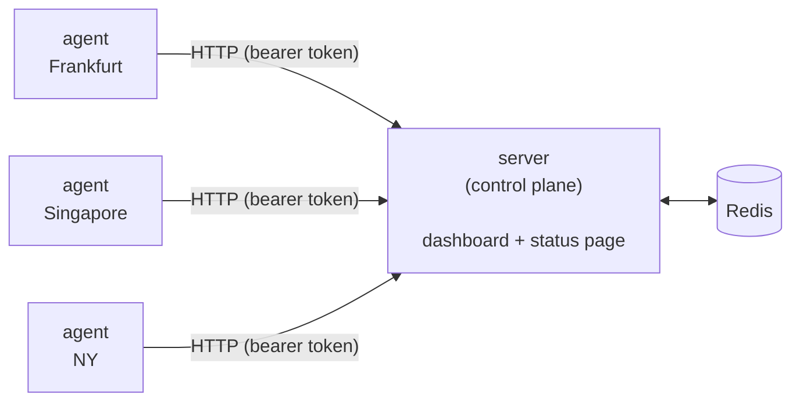

# Witness

🇬🇧 English | [🇷🇺 Русский](README.ru.md)

Self-hosted, **multi-region** uptime monitoring: no outage is official until multiple independent witnesses agree on it.

Most self-hosted monitors (Uptime Kuma, Gatus) check your service from a single
machine. If that one machine has a network hiccup, you get a 3am false alarm.
If your service is actually down only for users in another region, a
single-vantage-point monitor won't notice at all.

Witness runs lightweight agents in several regions. The control plane only
declares a service "down" when multiple independent regions agree — one
disagreeing region shows as **degraded**, not down. That's the whole idea.



Agents never talk to Redis directly — only to the server's HTTP API with a
per-region bearer token. Internally, results flow through a **Redis Stream**
with a consumer group, so ingestion (HTTP handler) and processing
(consensus + history) are decoupled and results survive a server restart
without being lost mid-flight.

## Quick start (try it locally, zero setup)

```bash
docker compose up --build
```

This starts the control plane, Redis, and **three demo agents** running as
local containers (not real geographic regions — just enough to see the
consensus logic work). Two demo checks are pre-loaded.

- Dashboard: http://localhost:8080 (login `admin` / `changeme`)
- Public status page: http://localhost:8080/status

## Going to production

### 1. Deploy the control plane

On your own VPS/server:

```bash
git clone https://github.com/icelanced/witness.git && cd witness
cp .env.example .env        # set ADMIN_PASSWORD, optionally Telegram alerts
docker compose -f docker-compose.prod.yml up -d --build
```

Put it behind a reverse proxy (Caddy/nginx) for TLS. The `/status` route has
no auth and is what you'd expose as `status.yourdomain.com`; everything else
sits behind HTTP Basic Auth.

### 2. Add a check

Open the dashboard → "Добавить проверку" → give it a name and a target
(`https://example.com` for HTTP, `host:port` for TCP).

### 3. Add a region

Dashboard → "Регионы-агенты" → type a region name (e.g. `frankfurt`) → you get
a one-time bearer token.

### 4. Run an agent in that region

Spin up the cheapest VPS you can find in that region (Hetzner/Contabo/Vultr,
~$4/mo) and run:

```bash
docker run -d --restart=always \
  -e SERVER_URL=https://status.yourdomain.com \
  -e AGENT_TOKEN=<token from step 3> \
  ghcr.io/icelanced/witness-agent
```

(Or build `Dockerfile.agent` yourself and push it to your own registry — no
prebuilt image is published by default.) The agent polls the server every
`POLL_INTERVAL` (default 15s) for its check list and reports results back
over HTTPS. No inbound ports need to be open on the agent's VPS.

Repeat for 2-3 regions. Three is the sweet spot: enough for consensus to mean
something, cheap enough to not think about the bill.

## Alerts

Open the dashboard → "Telegram-алерты" → paste your bot token (from
[@BotFather](https://t.me/BotFather)) and your chat id (from
[@userinfobot](https://t.me/userinfobot)) → save → hit "Отправить тестовое
сообщение" to confirm it's wired up correctly before waiting for a real
incident. There are two independent kinds of alerts:

- **Check status alerts** — a monitored target's consensus status changed
  (up→down, down→degraded, etc). Only fires on a genuine transition, never
  on every single poll, and names which regions currently agree/disagree.
- **Agent health alerts** — a region's *agent itself* stopped reporting for
  more than 90 seconds (or came back). This is about your monitoring
  infrastructure, not about your websites — useful because a region going
  silent otherwise only shows up as a greyed-out dot in the dashboard
  sidebar, which nobody's staring at.

## What's intentionally not here (yet)

- Long-term storage is Redis-only (sorted sets, 30-day trim). Fine for a
  pet project; swap in Postgres if you need longer retention or complex
  incident reports.
- No multi-user auth — it's single Basic Auth login, matching the
  "one operator, self-hosted" scope of the project.
- No HTTPS termination built in — put it behind Caddy/nginx/Traefik.

## Local development without Docker

```bash
go run ./cmd/server   # needs REDIS_ADDR, ADMIN_USER, ADMIN_PASSWORD env vars
go run ./cmd/agent    # needs SERVER_URL, AGENT_TOKEN env vars
```

## Security

What's covered:
- Admin login uses constant-time comparison and is rate-limited (10 failed
  attempts per 5 minutes per IP, successful requests never count against it).
- All state-changing admin actions (create/delete check, create/revoke
  region, save Telegram settings) require a CSRF token (double-submit
  cookie), not just a valid Basic Auth session.
- Agent tokens are generated with `crypto/rand` and can be revoked from the
  dashboard (Регионы-агенты → "отозвать") — this also wipes that region's
  last-known status from every check, so a leaked/compromised token can be
  cut off without touching Redis by hand.
- Check names and region names are HTML-escaped everywhere they're rendered
  (dashboard, status page, Telegram messages).

What's still on you:
- **Put this behind HTTPS.** Basic Auth credentials and agent bearer tokens
  are sent in plain headers — without TLS (Caddy/nginx/Traefik in front),
  anyone on the network path can read them. This isn't optional.
- **Don't reuse `docker-compose.yml` for production.** It exposes Redis on
  `6379` with no password for local demo convenience.
  `docker-compose.prod.yml` keeps Redis internal to the Docker network —
  use that one for anything real.
- **Agent tokens aren't scoped to specific checks.** By design, every region
  is meant to probe every check (that's what makes consensus meaningful), so
  scoping a token to a subset of checks would work against the architecture.
  What *is* enforced: submitting a result for a `check_id` that doesn't
  exist is rejected with 400, so a token can't be used to spam arbitrary
  garbage into Redis or resurrect a deleted check's history.
- Change `ADMIN_PASSWORD` from the default before exposing this anywhere.

## Tests

```bash
go test ./...
```

Covers the consensus/staleness logic, the alert-on-transition decision
(including the "first observation is already down" edge case), the CSRF
and rate-limiter middleware, and the store's Redis interactions against an
in-memory `miniredis` — no real Redis needed to run the suite.
